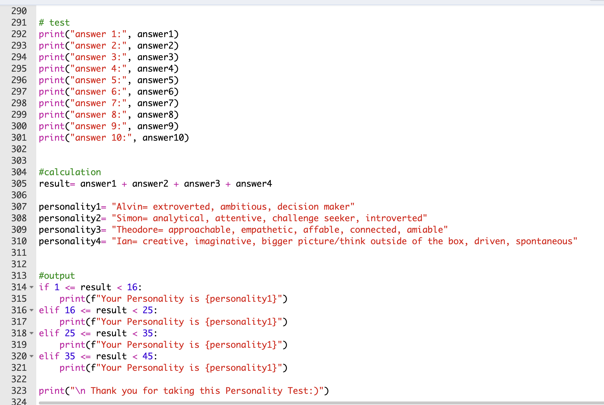

# Ciara O'Brien 

### About Me
Hello! I am a paraprofessional digital marketer in business with a year of expertise in social media management and content creation. 

With skills in event coordination, personnel management, problem-solving, database administration, photography, and caption writing. I am able to create and manage social media platforms for organizations, including our campus library and school clubs, and achieve high engagement from students in response. I am adept at using Excel, Canva, Zoho Social, and RStudio. 

My wide-ranging skill set, commitment to being detail-oriented, and passion for learning makes me a valuable asset. In my spare time, I like to bake desserts and Irish dance!

### Education
**BSc in Marketing & BioHealth, specialization: commercialization**  
Loyola University Maryland

### Projects

#### Inventory Manager on Excel 

Starting a week prior, as a part of assessment 5, we were assigned a project in organizing and analyzing product information as an inventory manager of choice by the means of Excel. My startup business was “Ciara’s Comfy Closet” that sold hoodies and sweatpants from different brands with ranging purchased and selling prices. I chose to base it on clothes that I wear often because I am familiar with brands that sell pieces of clothing that are for leisure wear as well as what price they normally go for. After finding the difference in selling price and purchased price, I had to solve the problem of if the profit margin needed to be increased based on the estimated profit. However, there was a challenge behind navigating ways to incorporate mixed or absolute cell referencing as well as conditional formatting in different cells when it came to week 4, assessment 6. It was harder to know columns best suited for certain conditions when given less direction and free reigns instead. That being said, I knew my current data was limited, so I decided to add more columns about the condition of the clothes, applying the =countif functions on the count and new condition count. To determine an acceptable profit, which I set to a minimum $12, all cells needed that same contusion. Therefore, I used absolute cell referencing, adding a $ before and after the cell letter. I referred to my notes from previous class lectures, to know the formatting of the cell references. On the other hand, it was reassuring to know confidently how to complete a table of average, minimum, and maximum profits through prior knowledge of excel functions, =average(_:_), =min(_:_), and =max(_:_). Next time I would improve the order of my columns so they are sectioned each in bunches that are related to each other. 

***
#### Grade Calculator on Excel

A grade calculator, made on Excel, is key to balance 5 different courses that tend to all have different sections with different percentage weights that make up that course’s grade. That being said, the total grade in percentage and, therefore, as a letter grade needed to be solved from this Excel sheet. I initially struggled with how to differentiate the points of an assignment versus its weight and how to represent that percentage through the points. Therefore, viewing different examples from my fellow peers helped me find a good starting point in how to divide up my chart. Therefore, I multiply the points of how much each section was worth by the amount of assignments from that section to get a total. That total score made it clear on how to add up all of the totals of all sections after imputing the amount of points per week in order to get a final total score. This method made it easier to visualize, especially when there are types of assignment per class. Additionally, the pie chart made it even more efficient to quickly understand the weight of each section. Something I could try to improve on next time is incorporating a condition that drops the three lowest grades. However, it depends on how grades work for the class, as it varies per class which adds to the uniqueness of this process. 

***
#### Personality Test on Python

In order to come up with different personalities in my personality test, I started by brainstorming movie characters who each have distinct and iconic characteristics that make each individual unique and distinct. First, I needed to figure out fitting questions and answers that each related to a different personality. Secondly, linking each question to answer was a key step in getting to the final product of an assigned personality. I struggled figuring out a couple different elements to this project, especially since there are various moving parts and if one part is incorrect, there is a domino effect making the rest incorrect as well. One main section I struggled with was figuring out the phrasing for error checking along with remembering to put, for example, question10= input() .upper() at the end of the error check. Another section I struggled with that is not as related to code, is thinking of best suiting answers that match some complexities to each personality. For example, I felt like some of the same answers could apply to different personalities in different ways. With the aid of professor knowledge, I was able to navigate how to approach error checking along with matching each answer with personality type. In the future, I would find a better way to define how the points could range depending on answer and personality type since it can be subjective. 

[def]: images/new_selfie.JPG